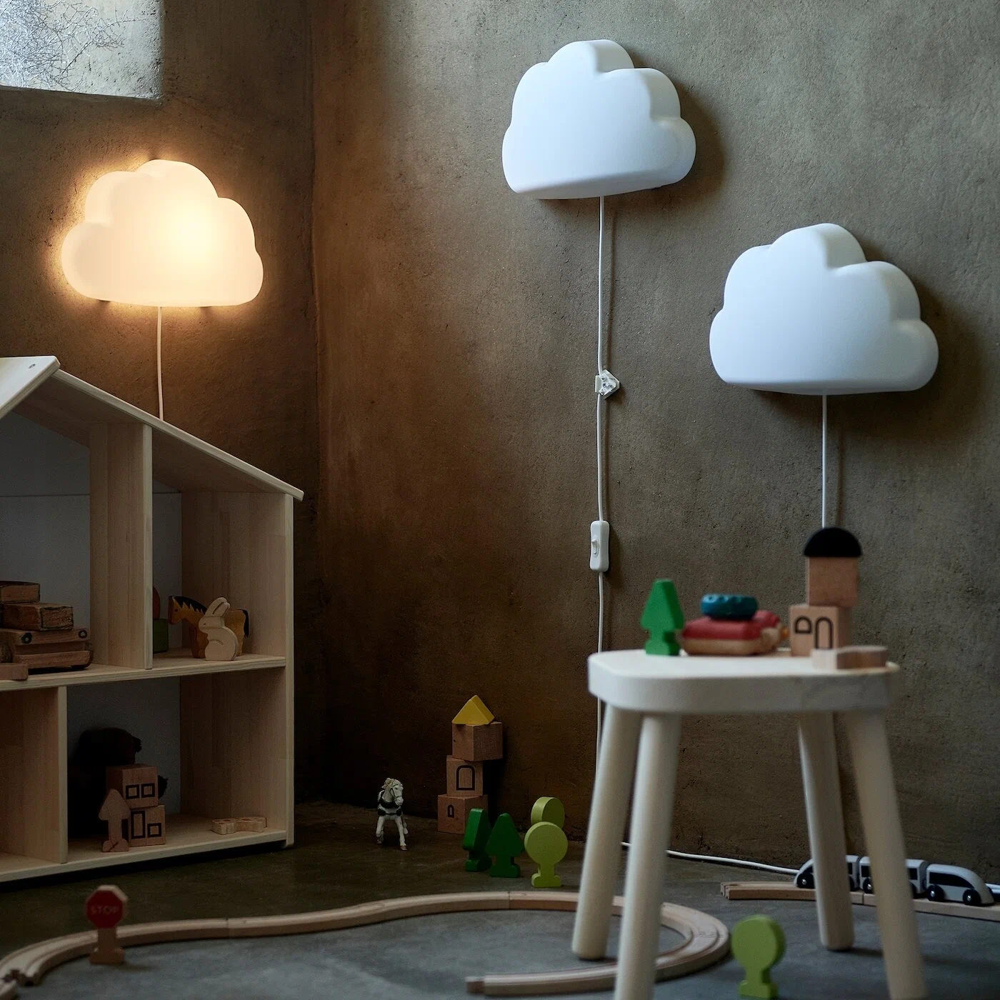

# SmartNightLight или Умный Ночник

Однажды один очень хороший человек посоветовал мне детский светильник (ночник) сыну в комнату, чтобы ему было приятно, интересно и не страшно самостоятельно засыпать.

На просторах Яндекс маркета оказывается есть раздел с товарами Ikea, с которой мы давно попрощались. А вот и он:

[Ссылочка](https://market.yandex.ru/product--upplyst-upplist-bra-svetodiodnyi-oblako-belyi/1777147671?do-waremd5=C87tfgdqqfuyrAzwJP6pmw&skuId=101853105465&sku=101853105465) наверное скоро протухнет, но всеравно оставлю.

Далее была закуплена плата ESP8266 Wemos Mini. [Подробности вот тут.](https://alexgyver.ru/lessons/esp8266/)

Смысл затеи состоит в том, чтобы:
+ Разобраться в данном МК
+ Научить светильник регулировать яркость самостоятельно
+ Реализовать плавное затухание в течении часа
+ Плавными вспышками сообщать о том что пора готовиться ко сну в заданное время
+ Реагировать на звук ночью и включаться на минимальной яркости на 5 минут
+ Реализовать имитацию рассвета
+ Время синхронизировать через WiFi подключение
+ Настройки расписания, и прочего с помощью web интерфейса

И это желательно сделать за пару вечеров =)

# Далее всякая всячина по поводу МК..

Для работы с платами на основе esp8266 нужно установить Arduino IDE, ядро и драйвер.

Идём в Файл/Настройки/Дополнительные ссылки для менеджера плат. Вставляем ссылку https://arduino.esp8266.com/stable/package_esp8266com_index.json.

Инструменты/Плата/Менеджер плат…, ищем в поиске esp8266 и устанавливаем. В списке плат появится семейство плат на базе esp8266.

Для работы с любой платой (даже самодельной) можно выбрать пункт Generic esp8266, будет доступен полный набор настроек.

Папка **libraries** должна лежать по адресу: C:\Users\{Имя пользователя}\Documents\Arduino

### Хранение суточных интервалов
Для хранения суточных интервалов я использую обычное 32-х разрядное число **uint32_t**. Часы, не мудрствуя лукаво, умножаем на **100**, минуты записываем как есть. Получаем начало интервала, для нашего примера это будет **2200 = 22*100 + 00**. Далее точно таким же способом формируем конец интервала, получаем **0830**.

Затем опять же “сдвигаем” начало интервала на **4 разряда вправо**, просто умножив его на **10000** и складываем с вычисленным концом интервала, получаем **22000830**. Это и есть “зашифрованный” суточный интервал. Его вполне можно хранить в **uint32_t**, и легко сохранить в flash-памяти в качестве параметров.

Расшифровать интервал (**timespan**) тоже очень просто с помощью целочисленного деления:

+ uint16_t time_begin = timespan / 10000;
+ uint16_t time_end = timespan % 10000;

Функция **checkTimespan()** учитывает интервалы не только в пределах одних суток (когда t1 меньше t2), но и интервалы с переходом через полночь (когда t1 больше t2). Но вот сформировать такой интервал более одних суток с помощью неё уже не получится, это как в истории с классическим будильником со стрелками.

+ https://arduino-esp8266.readthedocs.io/en/latest/ota_updates/readme.html