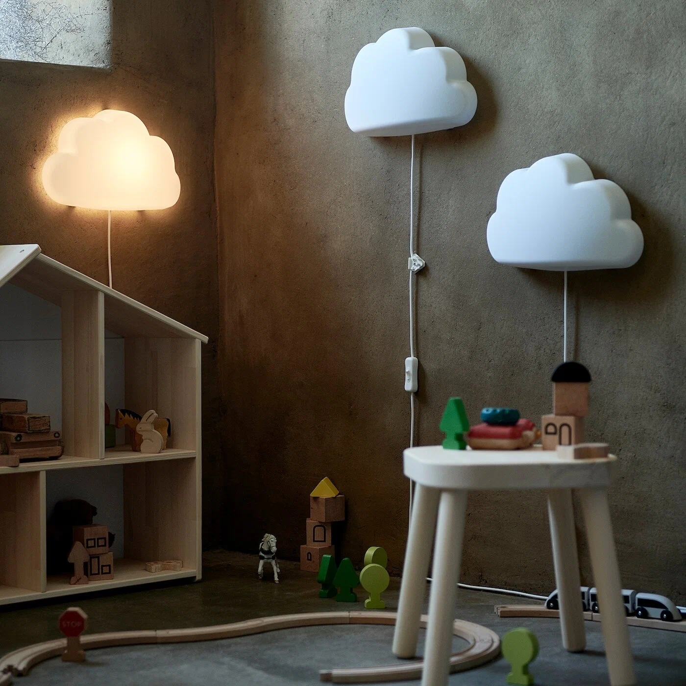
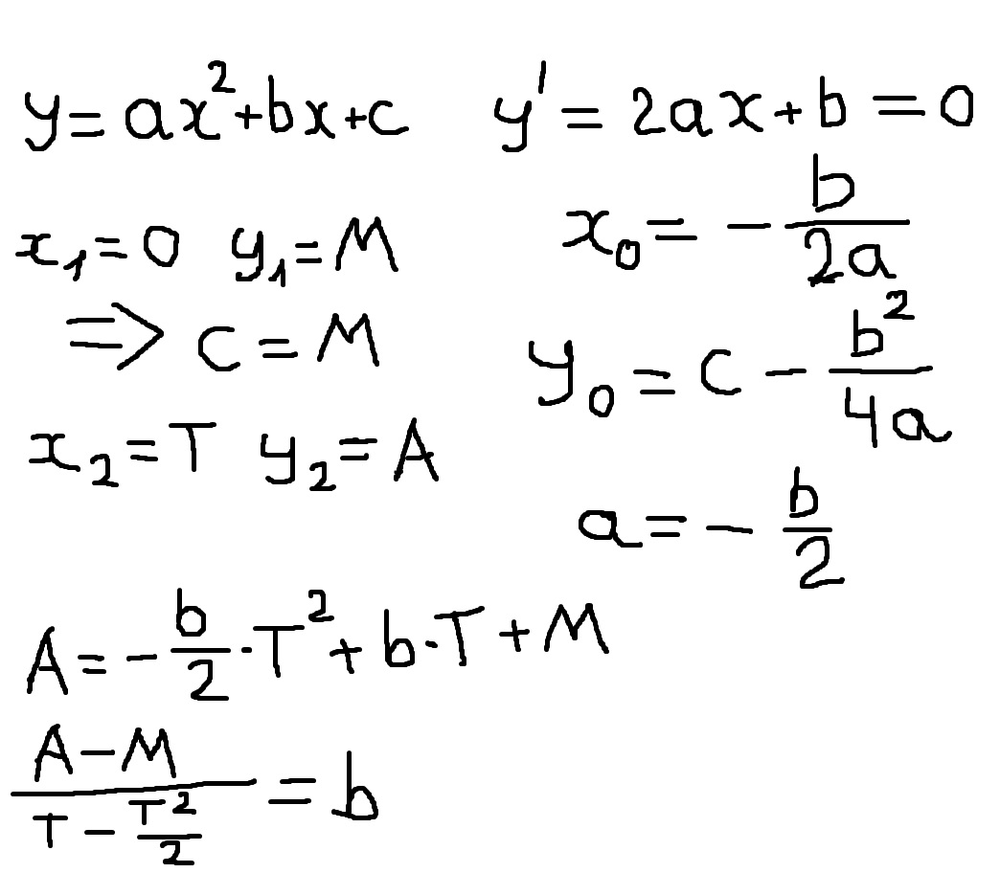
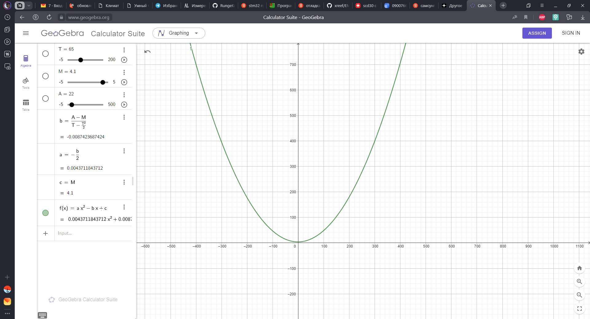

# SmartNightLight или Умный Ночник

Однажды один очень хороший человек посоветовал мне детский светильник (ночник) сыну в комнату, чтобы ему было приятно, интересно и не страшно самостоятельно засыпать.

На просторах Яндекс маркета оказывается есть раздел с товарами Ikea, с которой мы давно попрощались. А вот и он:

<p align="center"></p>

[Ссылочка](https://market.yandex.ru/product--upplyst-upplist-bra-svetodiodnyi-oblako-belyi/1777147671?do-waremd5=C87tfgdqqfuyrAzwJP6pmw&skuId=101853105465&sku=101853105465) наверное скоро протухнет, но всеравно оставлю.

Далее была закуплена плата ESP8266 Wemos Mini. [Подробности вот тут.](https://alexgyver.ru/lessons/esp8266/)

Смысл затеи состоял в том, чтобы:
+ Разобраться в данном МК
+ Научить светильник регулировать яркость самостоятельно
+ Реализовать плавное затухание в течении часа
+ Плавными вспышками сообщать о том что пора готовиться ко сну в заданное время
+ Реагировать на звук ночью и включаться на минимальной яркости
+ Реализовать имитацию рассвета
+ Время синхронизировать через WiFi подключение
+ Настройки расписания, и прочего с помощью web интерфейса

И это желательно сделать за пару вечеров =)

За пару вечеров не вышло, но со временем набралось вот что:

## Что умеет

| Режим | Что делает |
|-------|-----------|
| **Ручное включение** | из веб-интерфейса или Home Assistant, поверх расписания |
| **Отход ко сну** | в заданное время вспышки «пора спать», потом плавное затухание по параболе |
| **Имитация рассвета** | разгорается к заданному часу и держит максимум |
| **Реакция на шум** | ночью мягко зажигается от шума и так же гаснет — если ребёнок встал |

Плюс к этому:

+ **Настройка WiFi с устройства.** Паролей в прошивке нет: на чистой плате
  поднимается точка доступа, дальше всё вводится в браузере.
+ **Home Assistant** через MQTT с автодискавери — сущности появляются сами,
  YAML править не нужно.
+ **Метрики Prometheus** на `/metrics`, включая ночную активность в комнате.
+ **Обновление по воздуху** — и прошивки, и веб-интерфейса, с подтверждением
  того, что новая версия дожила до работы.
+ **Гамма-коррекция яркости** и 10-битный ШИМ, чтобы ползунок ощущался
  равномерным.

## Первое включение

Пароля от домашней сети в прошивке нет. На чистой плате устройство поднимает
свою открытую точку доступа:

1. Подключитесь к сети `SmartNightLight-XXXXXX` (последние три байта MAC).
2. Откройте `http://192.168.0.1` — веб-интерфейс откроется сам.
3. Вкладка **Настройки** → SSID и пароль домашней сети → **Сохранить**.
4. Светильник перезагрузится и подключится к вашей сети. Дальше он доступен
   по `http://smartnightlight-xxxxxx.local` или по IP с вкладки **Светильник**.

Если роутер сменился и портал больше не открывается — кнопка **Забыть сеть**
в настройках возвращает устройство в режим точки доступа. Если до неё уже не
добраться, то же самое делает `pio run --target erase` с последующей
перепрошивкой (сотрёт и все остальные настройки).

Пока время не пришло с NTP, расписание не работает: доступно только ручное
включение. В режиме точки доступа интернета нет, поэтому это нормальное
состояние до подключения к домашней сети.

## Сборка и прошивка

Проект собирается PlatformIO.

```bash
pio run                      # собрать прошивку
pio run --target upload      # прошить по USB
pio run --target uploadfs    # залить веб-интерфейс из data/ в LittleFS
pio test -e native           # тесты логики на хосте
```

Веб-интерфейс живёт в LittleFS отдельно от прошивки, поэтому `uploadfs` нужен
хотя бы один раз — иначе страница откроется с сообщением о незалитом фронтенде.
Обычная перепрошивка ни LittleFS, ни EEPROM с настройками не трогает: их стирает
только явный `pio run --target erase`.

Для OTA по WiFi раскомментируйте в [platformio.ini](platformio.ini) блок
`upload_protocol = espota` и подставьте адрес устройства.

## Как это устроено

Подробная документация — в [docs/_index.md](docs/_index.md): архитектура,
модули, протокол, подводные камни. Правила работы над проектом — в
[CLAUDE.md](CLAUDE.md), история изменений — в [CHAT_SUMMARY.md](CHAT_SUMMARY.md).

| Файл | Что внутри |
|------|-----------|
| [src/Wemos_Mini.ino](src/Wemos_Mini.ino) | setup/loop, WiFi (STA и точка доступа), веб-сервер, WebSocket, метрики |
| [src/NightLight.h](src/NightLight.h) | вся логика светильника: время → яркость и режим |
| [src/Dimmer.h](src/Dimmer.h) | гамма-кривая: яркость → скважность ШИМ |
| [src/SoundSensor.h](src/SoundSensor.h) | микрофон GY-MAX4466, размах сигнала и события |
| [src/MqttClient.h](src/MqttClient.h) | MQTT и автодискавери Home Assistant |
| [src/ConfigStore.h](src/ConfigStore.h) | настройки в EEPROM |
| [src/FailsafeOTA.h](src/FailsafeOTA.h) | подтверждение прошивки после обновления |
| [src/WsRxBuffer.h](src/WsRxBuffer.h) | сборка WebSocket-сообщений из TCP-кусков |
| [src/Log.h](src/Log.h) | единая точка вывода логов |
| [data/index.html](data/index.html) | веб-интерфейс, одна страница на LittleFS |
| [test/](test/) | тесты логики, собираются хостовым компилятором |

Браузер и устройство общаются по WebSocket: раз в секунду прилетает телеметрия
(яркость, режим, время, уровень шума, состояние сети), настройки уходят одним
сообщением `saveConfig`. Есть и обычный `GET /api.json` со снимком состояния —
удобно дёргать из curl, — и `GET /metrics` для Prometheus.

`NightLight.h` намеренно не знает ни про Arduino, ни про WiFi, ни про EEPROM:
на вход настройки и время, на выход яркость и режим. Поэтому он собирается
обычным компилятором и покрыт тестами.

### Хранение суточных интервалов

Время суток хранится как **hhmm**: часы умножаем на **100** и прибавляем минуты,
22:00 превращается в **2200**. Формат достался от первой версии прошивки и
сохранён — в этом виде настройки лежат в EEPROM и уходят в веб-интерфейс.

> Раньше интервал хранился целиком: начало сдвигалось на 4 разряда влево и
> складывалось с концом, `22000830` означало интервал с 22:00 до 08:30.
> Проверка попадания в интервал была отдельной функцией `checkTimespan()` с
> двумя ветками — обычный интервал и интервал через полночь, — а позиция
> внутри интервала считалась отдельно, и эти два расчёта могли разойтись.

Сейчас хранится только начало, а длительность лежит рядом отдельным полем.
Всё сводится к одному вычислению — сколько минут прошло от начала:

```cpp
uint16_t elapsed = minutesSince(start, now);   // всегда 0..1439
bool inside = elapsed <= length;
```

Переход через полночь обрабатывается сам собой: разность считается по модулю
суток. Интервал длиннее суток по-прежнему не выразить — как и на будильнике
со стрелками.

### Кривые яркости

Затухание и рассвет — одна и та же парабола с вершиной на краю интервала:

```
затухание: y(x) = min + (max-min) * ((L-x)/L)²   — максимум в начале
рассвет:   y(x) = min + (max-min) * (x/L)²       — максимум в конце
```

Ниже `min` (3 из 255) светодиод уже не тлеет, а мерцает, поэтому кривая туда
не опускается.

> Сначала коэффициенты выводились через общий вид `y = ax² + bx + c` и две
> точки — вот тот самый черновик и проверка в GeoGebra:
>
> <p align="center">
> 
> 
> </p>
>
> Вывод верный, но у рассвета знаменатель `T − T²/2` обращается в ноль при
> длительности ровно 2 минуты, и яркость становилась NaN. Запись через долю
> пути этого недостатка лишена и при обычных 60 минутах даёт ту же кривую с
> точностью до единицы яркости.

Отдельно от них живёт **гамма-кривая** — она переводит уже полученную яркость
в скважность ШИМ, чтобы равные шаги ползунка выглядели равными. Подробности в
[docs/modules/dimmer.md](docs/modules/dimmer.md).

## Железо

| Что | Куда |
|-----|------|
| Светодиодная матрица | `GPIO0` (`D3`), PWM 1 кГц, 10 бит |
| Микрофон GY-MAX4466 | `OUT` → `A0`, питание 3.3 В |

`GPIO0` участвует в выборе режима загрузки: в момент сброса он должен быть
подтянут к питанию, иначе плата не стартует. Подробности — в
[docs/hardware.md](docs/hardware.md).

## Полезные ссылки

+ https://arduino-esp8266.readthedocs.io/en/latest/ota_updates/readme.html
